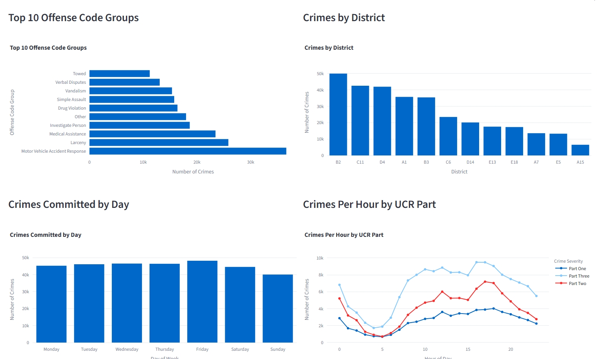
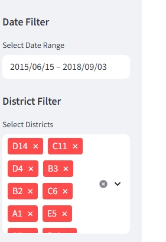
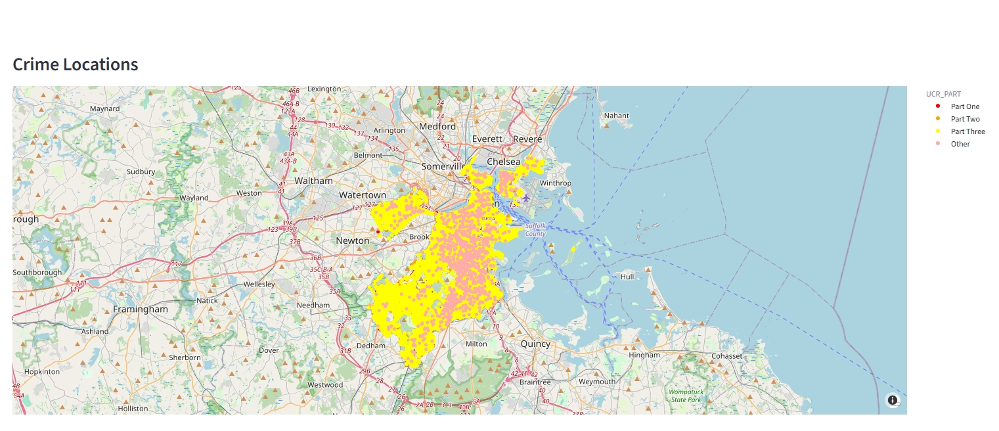

# Police Crime Dashboard – Baltimore Police Department

Interactive web dashboard for exploring and analyzing crime data from the **Baltimore Police Department** using **Streamlit**.

Live demo of streamlit app (Streamlit Community Cloud):  
→ https://police-dashboard-6pwbfngeinsgsyabpjz8hr.streamlit.app/  


## Screenshots

| Statistics          |
|---------------------------------------------------------------------------------------------------|
|  | 

| Filters             |
|---------------------------------------------------------------------------------------------------|
 | 


| Geographical map    |
|---------------------------------------------------------------------------------------------------|
 |

## Features

- Interactive filter: district, time
- Spatial visualization: Distribution of incidents on a map
- Statistical visualization: Diagrams show most common crimes, crimes by district, crimes by day and crimes by hour per UCR

## Technologie-Stack

- **Frontend / Dashboard-Framework**: [Streamlit](https://streamlit.io/)
- **Datenverarbeitung & Visualisierung**: pandas, numpy, plotly, matplotlib/seaborn
- **Geodaten**: plotly mapbox
- **Deployment**: Streamlit Community Cloud

## Datenquelle

- **Baltimore Police Department – Part 1 Crime Data**  
  The police data ('crimes.csv') comes from the Baltimore Police Department and is stored in a csv file.
  Format: CSV (extracted from `crimes.zip`)

## Installation & Start

1. To use the app, the ZIP file crimes.zip must be unzipped into the ./data folder.

2. clone repository
   ```bash
   git clone https://github.com/tb-2000/police-dashboard.git
   cd police-dashboard

3. execute app
    streamlit run dashboard.py

